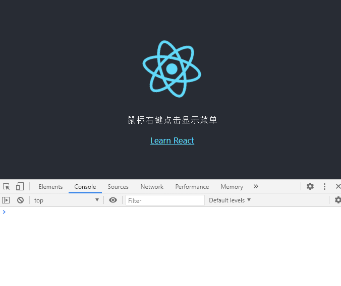

# react-context-menu

> context-menu自定义组件

	基于react进行组件开发

本示例开发思路，借鉴 [广发操盘手](https://hippo.gf.com.cn/) 鼠标右键操作；

## Usage
```html
<div onContextMenu={getContextMenu}>试试-鼠标右键点击</div>
```

```js
const getContextMenu = (e) => {
    e.preventDefault();

    utilMenu.show(e, {
      options: [{ title: '菜单' }],
    }, function (item, index) {
      console.log('contextMenu ==> 点击', item, index);
    })
  }
```

## screenshot


## API

| Option | Description | Type | Default |
| --- | --- | --- | --- |
| e | 事件对象 | Target | -- |
| params | 选项参数 | Object | -- |
| cbk | 回调函数 | Function | function() {} |

## Build Setup

``` bash
# install dependencies
npm install

# serve with hot reload at localhost:2017
npm run start

# build for production with minification
npm run build

# build for production and view the bundle analyzer report
npm run analyze
```